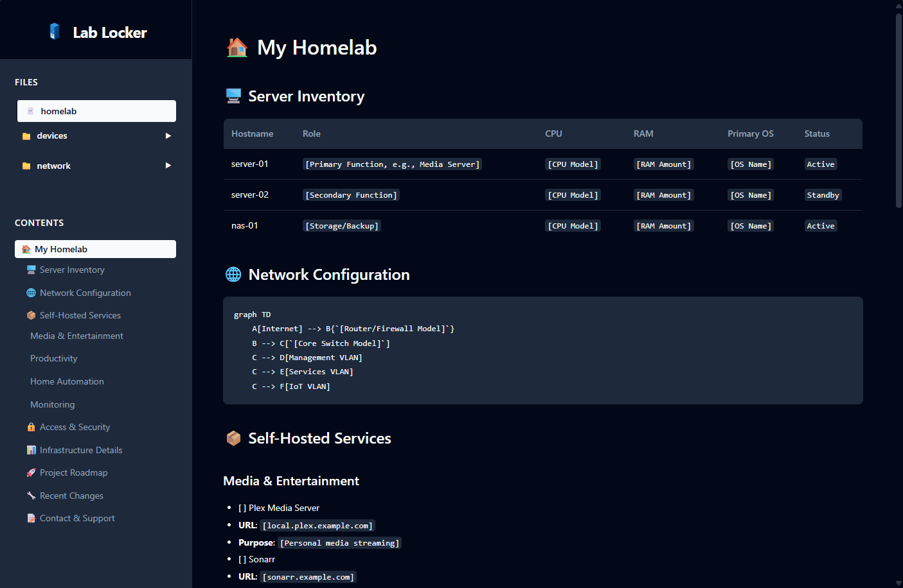

# 🏠 Lab Locker: Homelab Documentation Toolkit

## 🌟 Overview

Lab Locker is an open-source, self-hosted documentation solution designed specifically for homelab enthusiasts, system administrators, and tech hobbyists to create, manage, and share their infrastructure documentation.



## ✨ Key Features

### 📄 Markdown-Powered Documentation
- Simple, text-based documentation using Markdown
- Easy to edit, version control friendly
- Support for advanced Markdown features
  - Tables
  - Code blocks
  - Diagrams (Mermaid)
  - Emoji support

### 🌐 Web-Based Viewer
- Clean, responsive interface
- Dark/Light mode support
- Sidebar navigation
- Table of Contents generation
- File browser for multiple documents

### 🔧 Flexible Configuration
- Customizable via `config.json`
- Configurable app title
- Adjustable styling
- Flexible folder structure for documentation

## 🚀 Quick Start

### Prerequisites
- Python 3.8+
- pip (Python package manager)

### Installation
1. Clone the repository:
   ```bash
   git clone https://github.com/yourusername/lab-locker.git
   cd lab-locker
   ```

2. Install dependencies:
   ```bash
   pip install -r requirements.txt
   ```

3. Start the application:
   ```bash
   python lab-locker.py
   ```

4. Open in browser:
   - Default: `http://localhost:5000`

## 📂 Project Structure

```
lab-locker/
│
├── docs/                  # Your documentation files
│   ├── homelab.md
│   ├── network-topology.md
│   └── server-hardware.md
│
├── static/                # CSS and static assets
│   └── styles.css
│
├── templates/             # HTML templates
│   └── template.html
│
├── config.json            # Application configuration
├── requirements.txt       # Python dependencies
└── lab-locker.py          # Main application
```

## 🗺️ Roadmap & Future Plans

### Planned Features
- [ ] Advanced backend document management system
- [ ] Custom field configurations
- [ ] Dropdown menu-based document creation
- [ ] User authentication
- [ ] Markdown template generator
- [ ] Export to PDF/HTML
- [ ] Collaborative editing
- [ ] Version control integration

### Proposed Enhancements
1. **Dynamic Form Builder**
   - Create custom documentation templates
   - Drag-and-drop field creation
   - Predefined homelab-specific templates

2. **Intelligent Suggestions**
   - Autocomplete for common homelab terms
   - Validation for network configurations
   - Best practice recommendations

3. **Integration Capabilities**
   - Direct integration with monitoring tools
   - Automatic inventory discovery
   - API for external system updates

## 🤝 Contributing

Contributions are welcome! Please:
- Fork the repository
- Create a feature branch
- Submit a pull request

### Ways to Contribute
- Bug fixes
- Feature implementations
- Documentation improvements
- Design enhancements

## 📋 Requirements

- Python 3.8+
- Flask
- Markdown
- Pygments

## 📄 License

[Specify your license, e.g., MIT License]

## 🐛 Reporting Issues

Report issues on our [GitHub Issues Page](https://github.com/yourusername/lab-locker/issues)

## 📧 Contact

- **Project Maintainer**: `[Your Name]`
- **Email**: `[Your Email]`
- **Discord/Slack**: `[Community Link]`

---

**Happy Documenting! 📚🖥️**

*Last Updated*: {{ current_date }}