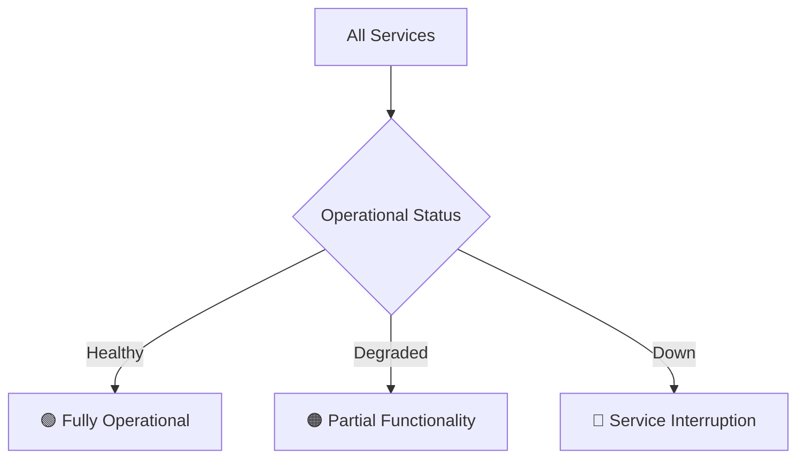

# 🌐 Services Inventory

## 📦 Self-Hosted Applications

### Media Management
| Service | URL | Purpose | Status | Access Method |
|---------|-----|---------|--------|---------------|
| Plex | `plex.example.com` | Media Streaming | `🟢 Active` | Local Network |
| Sonarr | `sonarr.example.com` | TV Show Management | `🟢 Active` | Authenticated |
| Radarr | `radarr.example.com` | Movie Management | `🟢 Active` | Authenticated |

### Productivity
| Service | URL | Purpose | Status | Access Method |
|---------|-----|---------|--------|---------------|
| Nextcloud | `cloud.example.com` | File Sync & Share | `🟢 Active` | SSO |
| Gitea | `git.example.com` | Git Repository | `🟢 Active` | User Accounts |
| Paperless-ngx | `docs.example.com` | Document Management | `🟢 Active` | Authenticated |

### Home Automation
| Service | URL | Purpose | Status | Access Method |
|---------|-----|---------|--------|---------------|
| Home Assistant | `ha.example.com` | Smart Home Control | `🟢 Active` | Local Account |
| Node-RED | `nodered.example.com` | Automation Flows | `🟢 Active` | Authenticated |
| MQTT Broker | `mqtt.example.com` | IoT Communication | `🟢 Active` | Token-Based |

### Monitoring & Management
| Service | URL | Purpose | Status | Access Method |
|---------|-----|---------|--------|---------------|
| Grafana | `monitor.example.com` | Metrics Dashboard | `🟢 Active` | SSO |
| Uptime Kuma | `status.example.com` | Service Monitoring | `🟢 Active` | Authenticated |
| Portainer | `docker.example.com` | Container Management | `🟢 Active` | User Accounts |

## 🔒 Access Control

### Authentication Methods
- **SSO Provider**: `[Authelia/Authentik/Other]`
- **Two-Factor Authentication**: `[Enabled/Disabled]`
- **Default Access Policy**: Deny by default, explicit allow

## 🚦 Service Status

## 🔧 Deployment Details

### Containerization
- **Platform**: `[Docker Compose/Kubernetes]`
- **Container Runtime**: `[Docker/Containerd]`
- **Orchestration**: `[K3s/Swarm/Standalone]`

### Networking
- **Reverse Proxy**: `[Traefik/Nginx]`
- **Domain Management**: `[Cloudflare/Local DNS]`

## 📝 Service Roadmap

- [ ] Implement more comprehensive backup strategy
- [ ] Add additional services
- [ ] Enhance monitoring and alerting
- [ ] Improve security configurations

## 🚨 Recent Changes

> **Last Major Update**: `[Date of Significant Change]`
> 
> **Notes**: `[Brief description of recent service modifications]`

*Last Updated*: {{ current_date }}