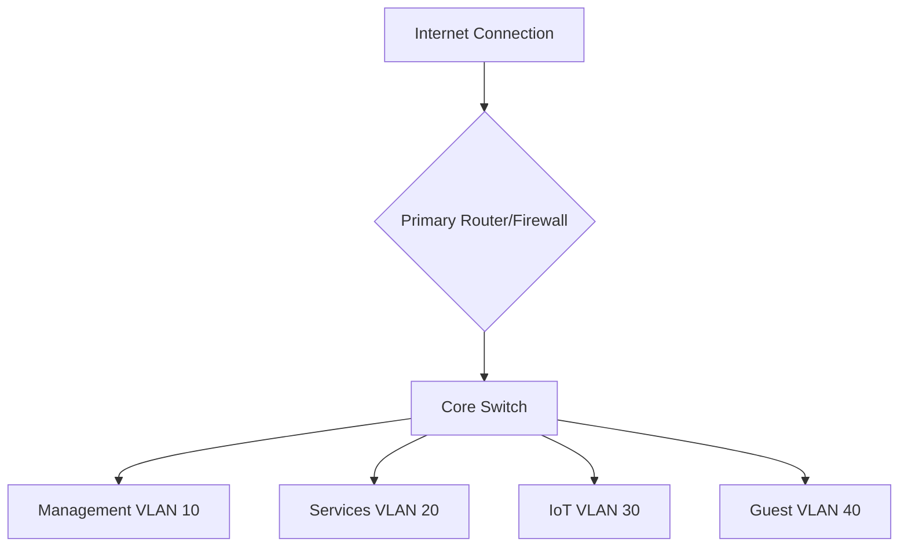

# 🌐 Network Topology Details

## 📡 Network Diagram

## 🔌 VLAN Configuration

### Management VLAN (10)
- **Purpose**: Device management and administration
- **IP Range**: `10.0.10.0/24`
- **Devices**:
  - Servers
  - Network Equipment
  - Management Interfaces

### Services VLAN (20)
- **Purpose**: Self-hosted applications and services
- **IP Range**: `10.0.20.0/24`
- **Key Services**:
  - Plex Media Server
  - Nextcloud
  - Home Assistant
  - Monitoring Tools

### IoT VLAN (30)
- **Purpose**: Internet of Things devices
- **IP Range**: `10.0.30.0/24`
- **Isolated Network**
- **Devices**:
  - Smart Bulbs
  - Security Cameras
  - Smart Plugs
  - Voice Assistants

### Guest VLAN (40)
- **Purpose**: Visitor Internet Access
- **IP Range**: `10.0.40.0/24`
- **Restrictions**:
  - Limited Bandwidth
  - No Access to Internal Networks
  - Temporary Credentials

## 🛡️ Network Security

### Firewall Rules
- Strict ingress/egress controls
- Default deny policy
- Logging and monitoring enabled

### Network Segmentation
- VLANs provide logical isolation
- Minimal inter-VLAN communication
- Zero-trust approach

## 📊 Connection Details

| Aspect | Configuration |
|--------|---------------|
| ISP Bandwidth | `[Download/Upload Speed]` |
| Primary Router | `[Model/Manufacturer]` |
| Routing Protocol | `[Static/Dynamic]` |
| DNS Servers | Primary: `[IP]` Secondary: `[IP]` |

## 🚧 Ongoing Improvements

- [ ] Implement more granular firewall rules
- [ ] Add secondary internet connection
- [ ] Enhance network monitoring
- [ ] Upgrade to enterprise-grade switching

*Last Updated*: {{ current_date }}